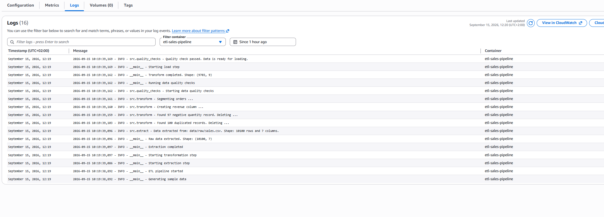
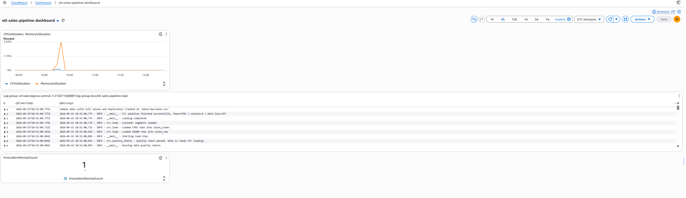
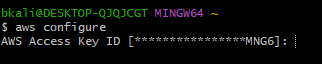
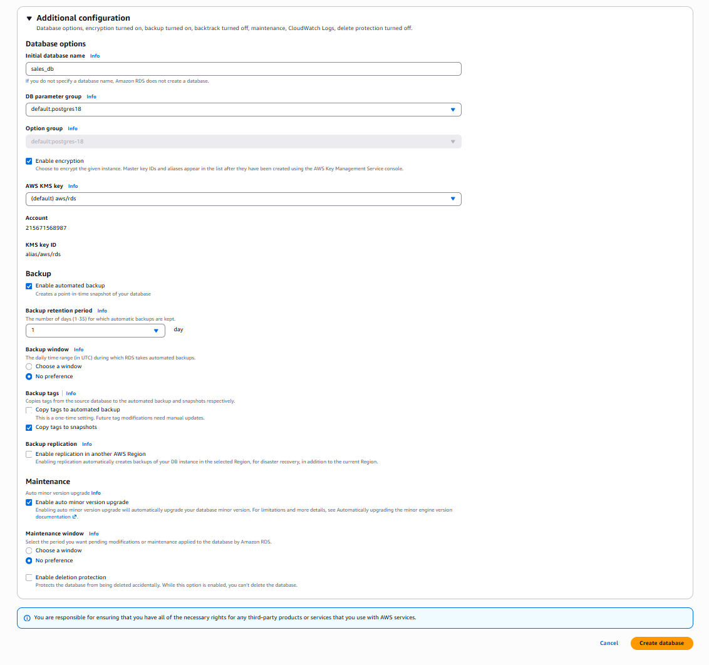
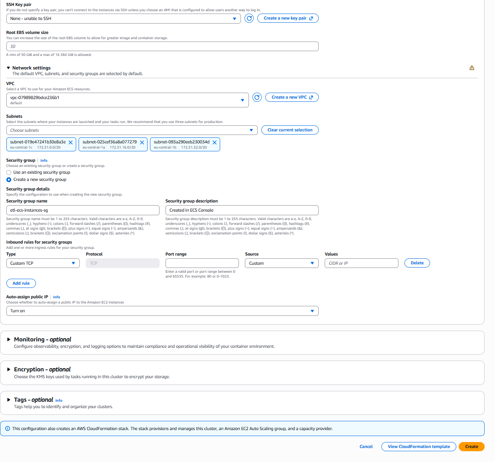
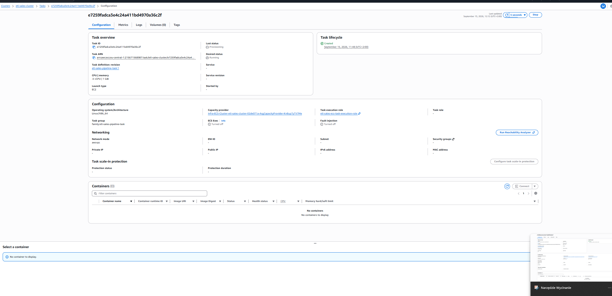
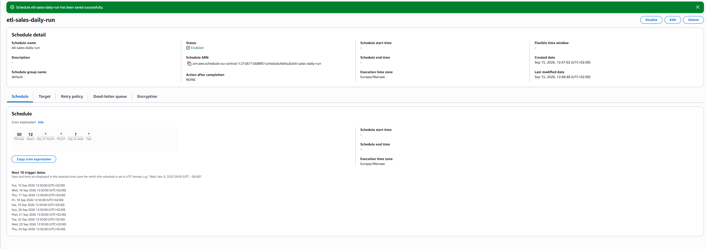
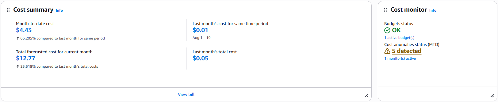

# AWS Migration — `etl-sales-pipeline`

This document describes the migration of a local Airflow/PostgreSQL/Docker Compose ETL pipeline to AWS, moving from a laptop-only setup to a cloud-native, event-driven, serverless-orchestrated pipeline — built primarily through the AWS Console.

**Original project:** batch ETL pipeline (extract → transform → quality checks → load) processing sales data into a PostgreSQL warehouse, feeding a downstream [dbt-sales-analytics](https://github.com/BartoszKalinowski1/dbt-sales-analytics) project.

## Why

- Move a local-only project into a real cloud environment, exercising the core AWS services a Data/Analytics Engineer works with day to day.
- Replace the manual Docker Compose + local Airflow workflow with managed, pay-as-you-go infrastructure.
- Keep the whole exercise inside a small free-tier credit budget, with cost control built in from step one rather than bolted on afterward.

## Architecture

```
                         ┌─────────────────────┐
                         │   EventBridge       │
                         │   Scheduler (cron)  │  daily trigger
                         └──────────┬──────────┘
                                    │ RunTask
                                    ▼
┌──────────────┐        ┌─────────────────────┐         ┌──────────────────┐
│  ECR         │──image─▶│  ECS Cluster (EC2)  │──────▶│  RDS PostgreSQL  │
│  (container  │        │  t3.micro instance   │  SQL   │  db.t3.micro     │
│   registry)  │        │  runs the ETL task   │        │  sales_db        │
└──────────────┘        └──────────┬───────────┘        └──────────────────┘
                                    │ reads raw data
                                    ▼
                         ┌─────────────────────┐
                         │  S3 (data lake)     │
                         │  raw / clean /      │
                         │  segments prefixes  │
                         └─────────────────────┘

Task state change (STOPPED) ──▶ EventBridge Rule ──▶ SNS (email alert)
                                                   └─▶ SQS (event queue)

Credentials:  RDS password ──▶ Secrets Manager ──▶ injected into ECS task at runtime
Security:     IAM users/groups (least privilege), MFA, security groups scoped per-resource
```

## Services used

| Service | Role |
|---|---|
| **S3** | Data lake for raw sales data (`raw/`, `clean/`, `segments/` prefixes), versioned, encrypted (SSE-S3), lifecycle rule on noncurrent versions |
| **RDS (PostgreSQL)** | Managed replacement for the local Docker Compose Postgres container |
| **ECR** | Private registry for the pipeline's Docker image |
| **ECS (EC2-backed)** | Runs the containerized ETL job as a batch task (not a long-running service) |
| **IAM** | Non-root admin user, group-based permissions, dedicated least-privilege task execution role |
| **Secrets Manager** | Stores the RDS master credentials; injected into the ECS task as a secret env var, never in plaintext |
| **EventBridge Scheduler** | Cron-based daily trigger for `ecs:RunTask` — a lightweight, serverless alternative to a full Airflow deployment |
| **EventBridge Rules** | Listens for ECS task state changes and fans out to SNS + SQS |
| **SNS** | Email notification on every pipeline run (success or failure) |
| **SQS** | Event queue capturing every task state change, for future processing/auditing |
| **CloudWatch Logs / Dashboard** | Centralized logs and a single-pane-of-glass view of cluster metrics + recent log lines |
| **AWS Budgets** | Cost alerts at 50/80/100% of a monthly threshold, set up before any billable resource was created |

## Why EventBridge Scheduler instead of Airflow

A managed Airflow deployment (MWAA) starts at several hundred USD/month even at the smallest configuration — far beyond what a small personal-project budget can sustain. Since the pipeline only needs a daily trigger with no complex DAG branching, **EventBridge Scheduler + `ecs:RunTask`** delivers the same "runs on a schedule, in the cloud, without a server to manage" outcome for effectively $0. This was a deliberate cost/complexity trade-off, not a workaround — for a project with real multi-step dependencies, Airflow (or Step Functions) would be the more appropriate choice.

## Security decisions worth calling out

- Root account used only once, to enable MFA; all subsequent work done as a dedicated IAM user in an `Administrators` group (policy attached to the group, not the user).
- RDS is technically internet-reachable, but locked down via security group rules scoped to specific source IPs / source security groups rather than `0.0.0.0/0`.
- The database password never appears in the task definition, the Docker image, or the repo — it's pulled from Secrets Manager at container start time via ECS's native secrets integration.
- S3 bucket blocks all public access by default and encrypts objects at rest.

## Pipeline run — evidence

Screenshot of a real run triggered automatically by EventBridge Scheduler, executed inside ECS, logged to CloudWatch:



Result verified directly in RDS after the run:

```
SELECT COUNT(*) FROM sales.sales_clean;        -- 9703
SELECT COUNT(*) FROM sales.customer_segments;  -- 3644
```

## CloudWatch Dashboard

The pipeline is monitored through an Amazon CloudWatch dashboard showing ECS task resource utilization, recent CloudWatch log entries, and the number of task invocation attempts.



This provides a single view of the pipeline's runtime activity and resource usage, complementing the centralized CloudWatch logs described above.

## Setup gallery

**Containerizing the pipeline — private ECR repository:**



**Managed PostgreSQL — RDS configuration (free-tier template, encryption on, minimal backups to control cost):**



**ECS cluster — EC2-backed capacity, network configuration:**



**ECS cluster instance registered and active, ready to run tasks:**



**Daily automated trigger — EventBridge Scheduler configuration:**



## Cost

Built within a single free-tier credit budget (~$180 available). Actual spend, tracked from day one via AWS Budgets (50/80/100% email alerts) and confirmed in the Billing console:
 

 
| Metric | Value |
|---|---|
| Month-to-date cost | **$4.43** |
| Forecasted total for the month | **$12.77** |
| Same period, previous month (baseline) | $0.01 |

Main running costs while the environment was live were the two always-on compute resources — the RDS instance and the ECS EC2 instance (both `t3.micro`/`db.t3.micro`). Everything else (S3, ECR, IAM, EventBridge, SNS, SQS, CloudWatch Logs) is effectively free at this scale.

**Current state of this environment:** RDS and the ECS EC2 instance have been decommissioned to bring ongoing cost to ~$0/month, since there's no active demo need right now. What remains live (S3 bucket, ECR image, IAM roles/policies, EventBridge rule + scheduler *disabled*, SNS topic, SQS queue, CloudWatch log group) costs nothing at rest and serves as evidence of the working setup. The environment can be fully reconstructed from this repo + the steps above in well under an hour — `schema.sql` recreates the database schema, the Docker image is already in ECR, and the task definition is preserved.

## How to reproduce

1. `docker build -t etl-sales-pipeline .` and push to a private ECR repo.
2. Create an RDS PostgreSQL instance, load `schema.sql`.
3. Store DB credentials in Secrets Manager.
4. Create an EC2-backed ECS cluster and register a task definition pointing at the ECR image, with env vars for `DB_HOST/DB_PORT/DB_NAME/DB_USER` and a `ValueFrom` secret for `DB_PASSWORD`.
5. Run the task manually once to verify, then attach an EventBridge Scheduler cron rule for daily automated runs, and an EventBridge Rule on ECS task state changes fanning out to SNS (email) and SQS (event log).
